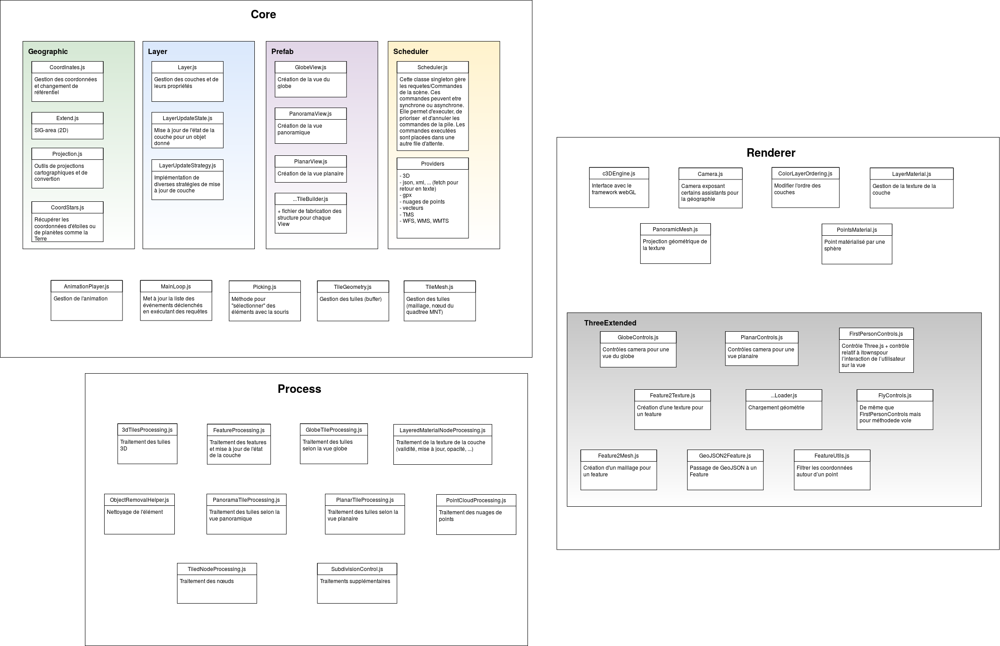
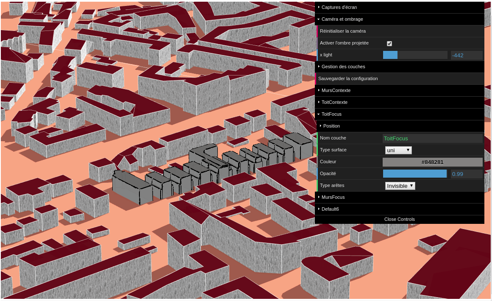
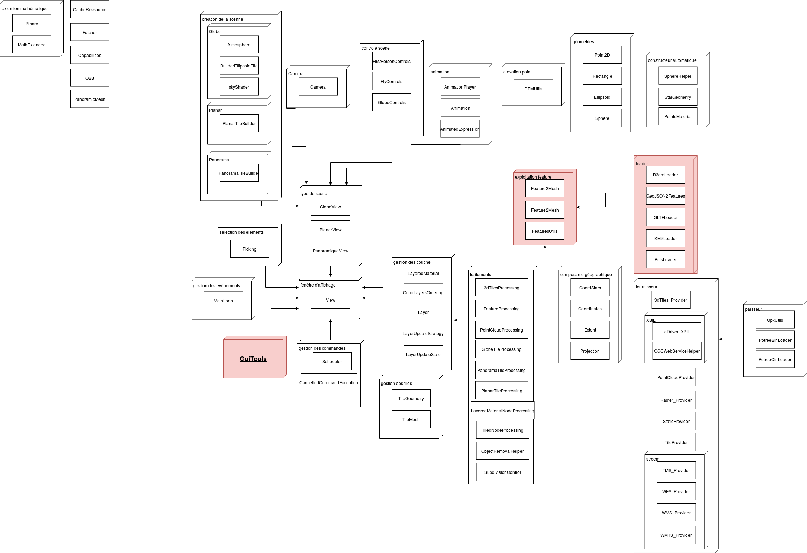
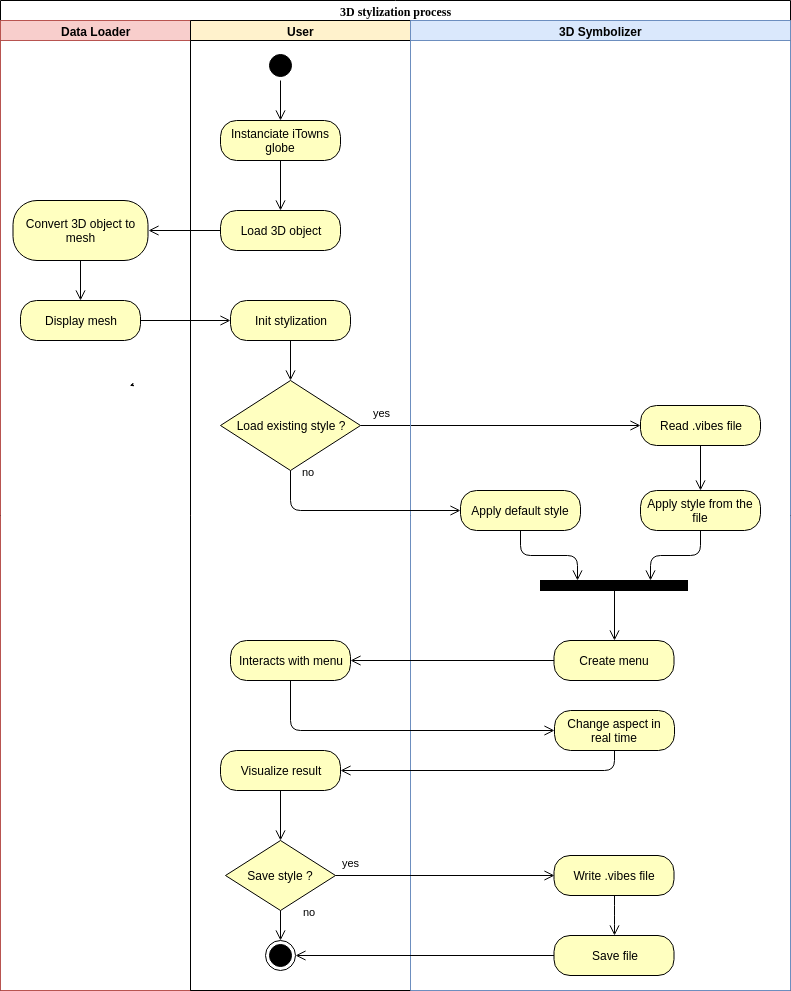
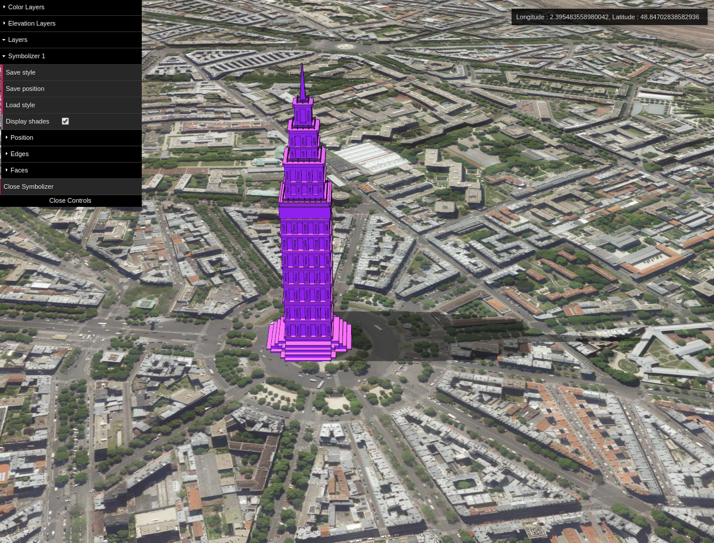

# Visualization in iTowns of Buildings Elegantly Stylized

[](https://travis-ci.org/arnaudgregoire/vibes)


## Summary

1. [Presentation of the project](#presentation-of-the-project)
2. [Project management](#project-management)
3. [Analysis of the existing situation](#analysis-of-the-existing-situation)
4. [Conception](#conception)
5. [First implementation](#first-implementation)
6. [Architecture set-up](#architecture-set-up)
7. [Advanced functionalities](#advanced-functionalities)
8. [Tests](#tests)
9. [Perspectives](#perspectives) 
  
  ​
## Presentation of the project

The VIBES (Visualization in iTowns of Buildings Elegantly Stylized) project consists in implementing geovisualisation techniques to stylize buildings on the platform iTowns. This project aims to provide a visual support for city planning, among other purposes.  

The user should be able to : 
* Load one or several 3D file (of various formats).
* Transform its/their visual aspect(s) using a GUI.
* Save the current style in a JSON-like format (to be defined).
* Load an existing style to re-apply it, including predefined styles (transparent, typical, sketchy).  
  
This project was proposed by Sidonie Christophe, from the COGIT laboratory (IGN), with Alexandre Devaux and Mathieu Bredif as technical support on iTowns.

**[Back to the top](#summary)** 


## Project management

This project will be carried out in March and April 2018 by a group of seven students in ENSG TSI, using SCRUM methodology. It will be divided into seven sprints, each one during a week. 

### Team

The seven members of the team are :
* Houssem Adouni
* El-Hadi Bouchaour
* Arnaud Grégoire
* Rose Mathelier *(Scrum Master)*
* Laurie Nino
* Adel Ouhabi
* Ludivine Schlegel
  
Given the number of people in the team, it is crucial to apply an efficient orgnization so everyone can be involved. To that end, we chose to work mostly in variable pairs, and to divide the tasks each week among these pairs (one person would be working alone since we are an uneven number).  
​    
### Backlog 

The previsional planning is the following :
* **Sprint 1** : analysis, conception, first version of the tool, CI/CD.
* **Sprint 2** : architecture set-up, definition of the 3D style with basic parameters + texture on faces, saving and loading.
* **Sprint 3** : adaptation of the architecture to stylize several objects, first trials on shadow management and edge texturation, analyse of exisiting situation regarding BATI3D loading in iTowns.
* **Sprint 4** : implementation of a BATI3D loader, edge stylization (dashed or continuous), basic geolocation and object movements, basic shadow management, layer management.
* **Sprint 5** : implementation of a BDTOPO loader (WFS), integration of the BATI3D loader in the project, edge texturation (sketchy style), possibility to click on objects.
* **Sprint 6** : advanced parameters including light, shadows, cameras and advanced texturation.
* **Sprint 7** : finalization, reports, presentation.  
  
A first previsional backlog was created at the beginning of the project. 
Each friday afternoon, at the end of the sprint, we take some time for :
* a review of the work completed during the week.
* a backlog grooming to plan the next sprint and divide the tasks (usually one or two tasks per pair).
* updating the report.
  
### Management tools

* **GitHub** - for code hosting.
* **Travis** - for continuous integration.
* **Easybacklog** - for backlog and planning.
* **Trello** - for task assignment and file sharing.
  
**[Back to the top](#summary)** 


## Analysis of the existing situation

### The iTowns environment

The main challenge of this project is that it has to be included into the architecture of the existing [iTowns](http://www.itowns-project.org/) project (version 2.3.0). Therefore, a necessary step is to get to know this architecture and to analyze it in order to know where our new functionalities could be located.



Two sorts of development can be carried out in iTowns :
* develop a new example, based on the existing classes of the core of iTowns.
* add new functionalities directly to the core.
  
This choice depends on the purpose of the tool. Our stylization tool is intended to be applied in multiple examples, therefore the main functionalities should be integrated in the source of iTowns. This implies that they should be as generic as possible, and respect the iTowns standards. An example will also be created, only to demonstrate how our tool should be used, but the goal is to make this example as simple as possible and to avoid including too much logic in it.
​    
### PLU++

The PLU++ project, developed in 2016 by Anouk Vinesse under the supervision of Sidonie Christophe and Mickaël Brasebin (COGIT), is a tool of 3D buiding stylization using Three.js, It will be used as proof of concept to help start our project. To that end, we analyzed the code from the latest version available on github : [IGN/PLU2PLUS](https://github.com/IGNF/PLU2PLUS)



The goal of this analysis is to find out how the following things can be done :

* Loading an OBJ file.
* Applying a style to a mesh.
* Changing this style dynamically using a user interface (dat.GUI).
  
#### Description of the project

The project consists in a webpage which display a 3D scene that contains a plane geometry with building on it, and a user menu made with dat.GUI to change the visual aspect of the buildings (color, opacity, style...) and do some other actions, such as recenter the camera, save the current style, etc.  

There are two sorts of buildings :
* **Focus** : the main buildings the user wants to work on, loaded from an OBJ model.
* **Context** : the surrounding buildings, loaded from BDTOPO or BATI3D (also OBJ models).  

[Presentation of PLU++](http://ignf.github.io/PLU2PLUS/)

#### Structure of the code

The main code is divided into 5 files, as follow :

* **rendu.html** : contains the main work.
* **fonctions_gui.js** : contains main functions for file loading, GUI initialization and update.
* **fonctions_load.js** : contains the utils functions to load 3D files.
* **fonctions_sliders.js** : contains the utils functions to handle the sliders.
* **fonctions.js** : contains other utils functions
  
#### How does it work ?

1. The user chooses a JSON file as an input, to define the initial style.
2. The GUI is created with those initial parameters.  
(the style - discret, typique, sketchy - determines which parameters of the GUI are visible).
3. Three.js materials are initialized with the initial parameters.
4. Event listeners are created on the GUI : each change will be repercuted directly on the materials previously created (for the context) or on each vertice created (for the focus).
5. OBJ models are loaded with the current material.
  
#### Possible ameliorations

Although the PLU++ project successes in creating an easy-to-use interface to dynamically change the stylization of 3D objects through various parameters, its implementation has some limitations. Particularly, its structure does not clearly separate the 3D geometry and the stylization itself.

However, it provides a helpful set of functions that can be re-use in our project, particularly for edges extraction and texture application.

Therefore, the idea of our project is to re-make the concept of PLU++ inside the iTowns structure, but in a more generic way so it can be re-used and re-adapted more easily.

### Definition of a style

TODO : what is a style (definition in litterature), specificities in 3D, definition of 'generic' styles (discrete, typical, sketchy)...

**[Back to the top](#summary)** 


## Conception

### Architecture

The architecture of our project must be included in iTowns. The following schema shows the different functionalities of iTowns, with the ones that interest us in red :  



The goal is to make this tool as general as possible, which means it must not depend on just one example. On the contrary, it should be usable on any example containing a 3D object on an instance of the globe, as a full-fledged functionality of iTowns. Therefore, we will create a new class Symbolizer, which will manage the 3D render. We will also extend the loading functionalities of iTowns in order to handle .obj files and other formats, using a new class called ModelLoader.

(image architecture with our functionalities)

### 3D stylization process

The 3D stylization will be done according to the following activity diagram :

  

### Style format

In order to save and re-use the style of an object, we need to find a way to store this information so it can be accessed easily. The obvious solution, in a JavaScript project, is JSON.  

The next question is : what do we stylize ? Does the stylization concern a single mesh, or a complex object with several styles at once ? A concertation with the client led us to implement both alternatives. Two stylization methods will be created :

(schema explicatif)

Therefore, there will also be two types of style formats :

* Generic style, applicable to any mesh :

```json
{
    "edges" : {
        "opacity": 1,
        "color": "#ffffff",
        "width": 1
    },
    "faces" : [
        {
            "opacity": 1,
            "color": "ffffff",
            "emissive": "ffffff",
            "specular": "ffffff",
            "shininess": 30,
            "texture": "./textures/texture.png"
        }
    ],
    
}
```

* Style format for a complex object with several meshes, all defined by a name :

```json
{
    "edges" : {
            "opacity": 1,
            "color": "#ffffff",
            "width": 1
    },
    "faces" : [ 
        {
            "name": "nom_element1",
            "opacity": 1,
            "color": "#ffffff",
            "emissive": "#ffffff",
            "specular": "#ffffff",
            "shininess": 30,
            "texture": "./textures/texture.png"
        },{
            "name": "nom_element2",
            "opacity": 1,
            "color": "#ffffff",
            "emissive": "#ffffff",
            "specular": "#ffffff",
            "shininess": 30,
            "texture": "./textures/texture.png"
        },{
            "name": "nom_element3",
            "opacity": 1,
            "color": "#ffffff",
            "emissive": "#ffffff",
            "specular": "#ffffff",
            "shininess": 30,
            "texture": "./textures/texture.png"
        }
    ]
}
```

**[Back to the top](#summary)** 


## First version of the tool : basic functionalities

The first version of our tool was first based on the iTowns example "collada". It is located on a new example called "VibesObj". To try it, simply run this example on our fork of iTowns, available at [this adress](https://github.com/arnaudgregoire/itowns-style).  

### Loading a 3D object in iTowns

The first step to stylize a 3D object is to load this object and make it visible. We focused on the .OBJ format at the beginning, as we already had samples for testing. We used the Three.js extension *OBJLoader*, already included in iTowns in the node module three-obj-loader ([source](https://github.com/sohamkamani/three-object-loader)).  

To load a 3D object in iTowns, we have to follow the following steps :
* Instanciate the globe.
* Instanciate the OBJLoader and call the load function.  
  
The following steps are implemented in the callback of the load function.
* Place the object on its right location, rotate and scale it if necessary.
* Put the object layer in the camera layers so it is rendered.
* Initialize a material and assign it to the object.
* Update the transformation (with updateMatrixWorld()).
* Add the object to the scene.
* Notify the change to the globe view.

The loaded object should now appear on the globe at the chosen position. We chose to first display it with a *THREE.MeshPhongMaterial*, with these parameters :
* **color: #ffffff**
* **transparent: true**
* **side: THREE.DoubleSide**
* **castShadow: true**

We implemented a drag and drop functionality to easily load the 3D object (on .obj format), with a fixed geolocation for now. The example models are located in examples/model. We have been using croutitower.obj, test.obj and destroyer.obj for our tests.

(image croutitower)

### Applying a style to a mesh with Three.js

To change the stylization of an object, we must know how this object is structured and where the information about its aspect is stored.  

The objects we just loaded are actually a group of meshes (type *THREE.Group*). For example, the croutitower is composed of 14 meshes. We can access these meshes by iterating over the children of the object. Then we just have to access the attribute *material* of each mesh and change the attributes we want to change.  

The basic implemented parameters are : **color**, **opacity**, **emissive color**, **specular color**, and **shininess**. 

### Creating a user interface to dynamically modify the stylization

The Javascript library [dat.GUI](https://github.com/dataarts/dat.gui) allows to create a user simple interface with buttons, sliders, checkboxes, etc. It is already used in iTowns, in the GuiTools class, to handle color and elevation layers on the globe. Thus, we will re-use this menu and add our own stylization parameters on it. Each element of the menu has an event listener with a callback function that performs the corresponding stylization on the mesh.  

(menu dat.GUI basic stylization)  

### Saving and loading a style

Our tool must also allow to save the current style in a *.vibes* file (see [above](#style-format)) and re-load it later. We used [FileSaver.js](https://github.com/eligrey/FileSaver.js/) to save the file as a Blob object.  

We used the Javascript object FileReader to load a file and get the data in it. This data can then be parsed in JSON and read directly to be applied to the meshes.  
When a stylesheet is loaded, the values of the GUI are updated to match the current stylisation of the object.

**[Back to the top](#summary)** 


## Architecture set-up

Although the first version is functional, it did not respond to the main issue of the project, which is created a generic tool, included in iTowns. Therefore, in a second step, we divided the functionalities described in the previous paragraph into four files :
* **ModelLoader.js** : the class to loads different sort of 3D objects (just *.OBJ* for now).
* **Symbolizer.js** : the class that carries all the stylization functionalities.
* **LayerManager.js** : the class that manages the user interface.
* **VibesTest.js** : the example file (linked to the HTML document) where we call the previous classes.
  
(class diagram)

### Class ModelLoader

This class has 2 attributes :
* **view** : the iTowns view, passed as parameter of the constructor.
* **model** : initialized as null, this attribute will carry the object loaded and the edges extracted from it (see [after](#edges-extraction)).  
  
It contains one public method for each format. These functions convert the 3D object into a group of meshes adapted to the symbolizer, and call an internal method to load the object in iTowns. The final object (and its edges) are stored in the attribute *model*.  

A callback function should be passed in the parameters of the public method, to specify what should be done when the loading is complete.  

#### OBJ Loader

TODO : describe how we load OBJ data.

#### BATI3D Loader

TODO : describe how we load BATI3D data.

#### BDTOPO Loader

TODO : describe how we load BDTOPO data (WFS extruded).

### Class Symbolizer

This class has 5 attributes, all passed as parameters of the constructor :
* **view** : the iTowns view.
* **obj** : the object to stylize (a group of *THREE.Mesh*).
* **edges** : the edges to stylize (a group of *THREE.LineSegments*).
* **menu** : the GUI where the user interface will be created.
* **nb** : the ID of the symbolizer.  
  
When the Symbolizer is instanciated, a default style is applied to the object with random colors.  

The public methods are the two different GUI initialization : 
* **initGuiAll** : opens one Symbolizer for all the meshes of the object.
* **initGui** : opens one Symbolizer for each mesh.

(image croutitower with initGuiAll and with initGui)

Each initializer method builds the structure of the GUI, with the appropriate folders and call the 'add' functions.  
The 'add' functions create buttons and sliders to the menu with dat.GUI, and define the 'change' functions as callbacks.  
The 'change' functions perform the concrete stylization on the object/edges.  
(TODO : replace this paragraph by a schema)

(TODO : describe what the Symbolizer actually does, with images and everything...)

### Class LayerManager

In the first version, our tool was only able to stylize one object. But what if the user wants to apply a style to several objects ?   

To answer this issue, we needed to add a layer management functionality : instead of opening a symbolizer directly after the loading, the layer is added to a list of checkboxes, similar to those we can find in GIS, where the user can manipulate it. 

(image menu layer)  
​        
#### Layer management

When one layer (or more) is checked, three buttons appear :
* **Stylize object** : open a symbolizer to stylize all the meshes of the objects at once.
* **Stylize parts** : open a symbolizer to stylize the meshes of the objects independently (the objects must have the same number of meshes).
* **Delete layers** : delete the objects. 
  
These buttons disappear when there is no more layers checked (if they are all unchecked or deleted).
​    
(diagramme d'activité)

#### Geolocation

An important issue concerning the layers is how to **geolocalize** them. This is easy when the data itself is georeferenced, but formats like .OBJ do not provide this information. Therefore, in this case, the user should tell where the object is located, but the question is how.  

The answer to this issue is twofold :
* The user should be able to enter (somehow) the parameters to locate the object he wants to stylize.
* He also should be able to adjust the position he chose (slight translations, rotations, scaling) later.  

##### Adjustments

The second problem can be solved thanks to the GUI, with a few more sliders to move the objects, just like it is done in PLU++.  
In order to move the objects, we applied the translation methodes on x,y and z, and that allow the user to use the sliders on the GUI to do that.
another feature let the user to move the object after clicking on it or select it from the GUI , and that can be done with the keyboard keys ((a,z) or (4,6)) on the X axis, ((w,x) or ( 8.2)) on the Y axis and ((q,s) or (7.3)).

##### Absolute positionning

But this method cannot be used to georeference an object completely - we cannot use a slider to move a mesh from one end of the world to the other. Until this step, the coordinates were hard-coded in the example, which is not satisfying.  

We could open a window for the user to enter the coordinates between the drag and drop and the actual loading of the object, but it seems pretty heavy. Plus, the user may not care about where the object is located, and just want to use the stylization tool.  

Therefore, we went for an intermediary solution, where a default position (on place de la Nation, Paris) is hard-coded, and the user can drag and drop a second file containing the necessary parameters to put the object at its right position (coordinates, rotations and scaling). The file looks like this :  

```json
{
    "name": "croutitower",
    "coordX": 2.396159,
    "coordY": 48.848264,
    "coordZ": 50,
    "rotateX": 0.5,
    "rotateY": 0,
    "rotateZ": 0,
    "scale": 300
}
```

It can be drag and dropped at any time, and will be applied to all the checked layers in the GUI.

**[Back to the top](#summary)** 


## Advanced functionalities

### Edges extraction

The edges are extracted from the geometry thanks to a *THREE.EdgesGeometry* object, then converted into *THREE.LineSegments* and added to a group of lines that will be placed in the scene at the same coordinates as the object.  

These edges are initialized with a *THREE.LineBasicMaterial* that can be stylized the same way as the materials on the faces. However, unlike the faces, the edges can only be stylized as a whole, we did not separate them according to the mesh from where they were extracted.  

The parameters we can currently change are : **color**, **opacity**, **width**.
We also plan on adding a parameter to change the style of the edges (continuous or dotted line), but we faced a problem related to the Three.js library. Indeed, this parameter require a function of Three.js that was moved in the *THREE.Line* class in a later version than the one included in iTowns, and we could not make this function work at its previous location. This is one of the problem we need to solve in the next sprints.  
​    
### Texture application

The PLU++ project allows to apply texture on the faces of the object, but also on the edges, in order to diversify the possible styles. The images we used as sample textures were taken from this project and from the croutitower example.  

#### On a face

Applying a texture on a face is rather easy : the *THREE.MeshPhongMaterial* has a 'map' parameter that can store a texture. We used *THREE.TextureLoader* to load an image from its local path and added the texture we obtained to the material.  

The source image must be located in the right folder in iTowns (*examples/textures*) and the name of the texture must appear in the *listeTexture.json*. The path of the texture is saved in the stylesheet.  

When a texture is applied, a new slider appears on the GUI to change the repetition of the texture.  

(image menu + image exemple)

#### On an edge

An edge is a linear geometry, so we cannot simply apply a texture on it. A solution, based on Mathieu Bredif's work, has already been found in the PLU++ project. It consists in creating a quadrilateral where the edge is, and apply the texture to it. This rectangle should always be facing the camera so the edge is always visible.  

The implementation is in progress.  

(image exemple sketchy edge)

### Environment stylization

Customizing the stylization of the environment in iTowns is a little more challenging than the other parameters, as it implies acting on elements that are already implemented. Unlike PLU++, the environment is already set, so we cannot re-use the functions.

#### Lights

Possible addition : changing light direction, color, intensity... 

#### Shadows

In a native iTowns application, there is no easy way to implement buildings shadow. In fact, iTowns modify the classic shadowmapping method, making it not usable for us. In order to create shadows of buildings on the ground, we create 2 objects : 

- a  1x1km plan centered on building. This plan is made of ShadowMaterial. This particular Threejs material can receive shadows, but otherwise is completely transparent. We make it semi-transparent in order to have a nice shadow (less dark). Unfortunately, we had to disable the depthTest to make our shadow appear. According to our product owner Alexandre Devaux, its due to a bug internally to itowns. This lack of depthTest makes sometimes a visual bug where shadows will be put in front of the building.

  ```javascript
  var planeGeometry = new THREE.PlaneBufferGeometry(20, 20, 32, 32);
  var planeMaterial = new THREE.ShadowMaterial({ side: THREE.DoubleSide, depthTest: false });
  planeMaterial.transparent = true;
  planeMaterial.opacity = 0.5;
  var plane = new THREE.Mesh(planeGeometry, planeMaterial);
  ```

- a light located above the building. Its a ThreeJS PointLight that gets emitted from a single point in all directions. We woud have prefered use a DirectionalLight like the one already implemented internally iniTowns but we never achieved to make it work.  The drawback of PointLight is that two identical object in the 3D scene located at different places will have different shadows.

  ```javascript
  var plight = new THREE.PointLight(0xffffff, 1, 0, 1);
  var coordLight = coord.clone(); // Building coordinates
  coordLight.setAltitude(coordLight.altitude() + 350);
  plight.position.copy(coordLight.as(this.view.referenceCrs).xyz());
  plight.position.y += 70;
  ```

Finally, we add  an option "Display shades" in our dat.gui to let to the user the choice of displaying our shadows. Here is a screenshot of one building with it shadow.



#### Camera

Possible addition : different cameras PoV (birds-eye-view, oblique, immersive), camera reinitialization.  

**[Back to the top](#summary)** 


## Results

### Presentation of the final tool

...

### How it works

...

### Limits and perspectives

...

**[Back to the top](#summary)** 


## Review

### Problems met during the project

...

### Personal reviews

...

### Conclusion

...

**[Back to the top](#summary)** 


## Tests

### Unit tests

In order to write our unit tests we rely on the mocha framework which was used in the previous unit tests of Itowns project. This framework is a feature-rich JavaScript test that can be used for both Node.js and browser-based testing,it's 
interfaces system such as BDD, TDD, Exports, QUnit and Require-style allows developers to choose their style of DSL.

In our project we choose to continue working with the BDD (Behavior Driven Development ) interface which provide a syntax including describe() , context(), it(), specify(), before(), after(), beforeEach(), and afterEach(), it focus on what the application should do, and on how it will do it.

As we mentioned above we continued working and adding some tests to the previous test folder of the Itowns project, a part of these unit tests run using the CLI (commande line interface) and the others need the browser to be executed since our application uses the Dom element,and the nodeJs server does not have access to the Dom,we had to run these kind of tests on the browser. to do that we made a simple HTML page which our test runner page (/mochaTest.html). 
The page loads Mocha, the testing libraries and our test file(/tests/vibesObjTest.js) and finally to run the tests, we simply needed to open the runner in a browser.
the pictures below show the results of the test units:


  


### CI/CD

Travis.

**[Back to the top](#summary)** 


## Perspectives

**TO DO :**

**Stylization :**
* Finish texturing edges.  
* Try to update the Three.js library to use the LineDashedMaterial.  
* Implement environment parameters (light, shadow, camera).  
* Load a style from MTL (convert it in vibes)  

**Layers :**
* Improve layer management.  
* Geolocation : through a georef file ? or move it directly (cf three editor)  
* More formats : 3DS, WFS extruded...  
  
**[Back to the top](#summary)** 


## Authors

* **Houssem Adouni**
* **El-Hadi Bouchaour**
* **Arnaud Grégoire**
* **Rose Mathelier**
* **Laurie Nino**
* **Adel Ouhabi**
* **Ludivine Schlegel**
  
  ​
**[Back to the top](#summary)** 

